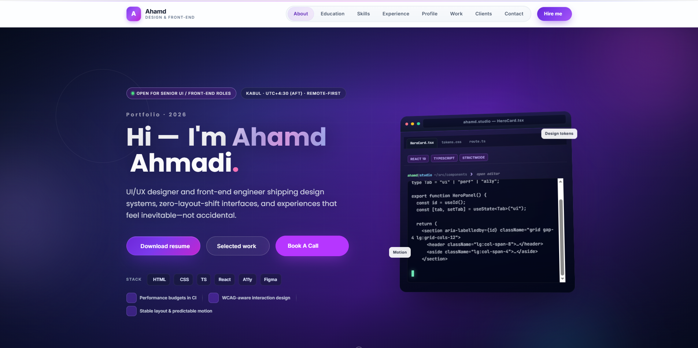

<div align="center">

# **LumenDesk**

### *One-page portfolio for UI/UX designers & front-end engineers*

[](https://developer.mozilla.org/docs/Web/HTML)
[](https://developer.mozilla.org/docs/Web/CSS)
[](https://tailwindcss.com/)
[](https://jquery.com/)

**LumenDesk** is a refined, production-minded single-page template: glass-style navigation, a code-editor hero, scroll-driven motion, an interactive work carousel (Swiper), and accessibility-minded structure—without a heavy build step.

[Features](#-features) · [Preview](#-hero-preview) · [File map](#-project-structure) · [Quick start](#-quick-start) · [Customization](#-customization)

</div>

---

## Hero preview

The screenshot below is the **above-the-fold hero**: split layout with status chips, gradient headline, CTAs, stack pills, and a **live-style code terminal** (`HeroCard.tsx` / `tokens.css`) with floating “Design tokens” and “Motion” cues—matching the template’s front-end narrative.

<div align="center">



*Hero section reference: `image.PNG` (repository root). Drop in your own export to refresh the preview for your fork.*

</div>

---

## Features

| Area | What you get |
|------|----------------|
| **Hero** | Full-viewport intro, badges (availability / timezone), gradient typography, primary & secondary CTAs, stack tags, checklist row, **typed terminal** mockup with React-flavored sample code. |
| **Navigation** | Sticky header (jQuery Sticky), pill / glass styling, mobile drawer, smooth in-page scrolling with easing and scroll-spy active states. |
| **About** | Advanced about layout with cards, metrics, and optional portrait area. |
| **Education** | Timeline-style education blocks with responsive grid. |
| **Skills** | Dual-panel skills layout with **animated progress bars** (Intersection Observer in `custom.js`) and WCAG-friendly `aria-valuenow`. |
| **Experience** | **Experience Pro** timeline (`experience-advanced.css`) with accent variables per role. |
| **Profiles** | Profile hub with icon cards (Flaticon + Font Awesome). |
| **Work** | **Swiper**-based portfolio strip; slides generated from data in `work-portfolio.js` with filters. |
| **Clients** | **Owl Carousel** logo strip for social proof. |
| **Contact** | Rich contact section with form UI, map embed, and social links. |
| **Footer** | Copyright block + scroll-to-top control. |

<details>
<summary><strong>Technical highlights</strong> (expand)</summary>

- **Tailwind CSS** via Play CDN with extended theme (fonts, brand colors, keyframes for fades, float, scroll bounce).
- **No bundler required** — open `index.html` in a browser or serve statically (see [Quick start](#-quick-start)).
- **Progressive enhancement**: scroll-reveal uses `IntersectionObserver` where available.
- **External CDNs**: Tailwind, Swiper, jQuery Easing—keep versions pinned if you deploy to production.

</details>

---

## Project structure

```text
browny-v1.0/
├── index.html                 # Single entry — all sections & asset links
├── image.PNG                  # Hero screenshot (this README + your marketing)
├── README.md                  # You are here
├── assets/
│   ├── css/
│   │   ├── style.css          # Base / legacy layout hooks
│   │   ├── responsive.css     # Breakpoints & mobile tweaks
│   │   ├── modern.css         # Modern portfolio + hero / nav / sections
│   │   ├── work-portfolio.css # Swiper work section
│   │   ├── experience-advanced.css
│   │   ├── font-awesome.min.css
│   │   ├── flaticon.css
│   │   ├── owl.carousel.min.css
│   │   └── owl.theme.default.min.css
│   ├── js/
│   │   ├── jquery.js
│   │   ├── jquery.sticky.js
│   │   ├── owl.carousel.min.js
│   │   ├── work-portfolio.js  # ISO_DATA + Swiper init
│   │   └── custom.js          # Nav, scroll, reveals, skills bars, Owl #client
│   └── fonts/                 # Flaticon + Font Awesome webfonts
└── …
```

> **Note:** Paths like `assets/logo/favicon.png` are referenced from `index.html`. Add your own favicon under `assets/logo/` if the file is missing locally.

---

## Quick start

1. **Clone or download** this repository.
2. **Optional — local server** (recommended so CDN scripts behave consistently):

   ```bash
   npx --yes serve .
   ```

   Then open the URL shown in the terminal (often `http://localhost:3000`).

3. **Or** open `index.html` directly — most features work over `file://`; some environments still prefer HTTP for iframes or strict browser policies.

---

## Customization

| Goal | Where to look |
|------|----------------|
| Brand name, meta, copy | `index.html` (search for the current brand string). |
| Colors & Tailwind tokens | `index.html` → `tailwind.config` inline script; plus `assets/css/modern.css`. |
| Work portfolio items | `assets/js/work-portfolio.js` → `ISO_DATA` array. |
| Client logos | `index.html` → `#clients` / `#client` carousel markup. |
| Skills percentages | `index.html` → `#skills` → `.progress-bar` `aria-valuenow`. |
| Hero terminal typing | `assets/js/custom.js` — logic targeting `#hero-terminal` / `#hero-terminal-code`. |

Replace **`image.PNG`** with your own hero capture when you rebrand; keep the filename or update the markdown image path in this README.

---

## Browser support

Targets **modern evergreen browsers** (Chrome, Firefox, Safari, Edge). IE-only shims in HTML comments are legacy and optional.

---

## License & attribution

Template evolution builds on classic single-page portfolio patterns. **Replace** placeholder names, emails, images, and client logos before publishing. If you ship a public demo, updating **`image.PNG`** keeps your README visually honest.

---

<div align="center">

**Built for clarity, motion, and a credible “design + front-end” story.**

*— LumenDesk*

</div>
